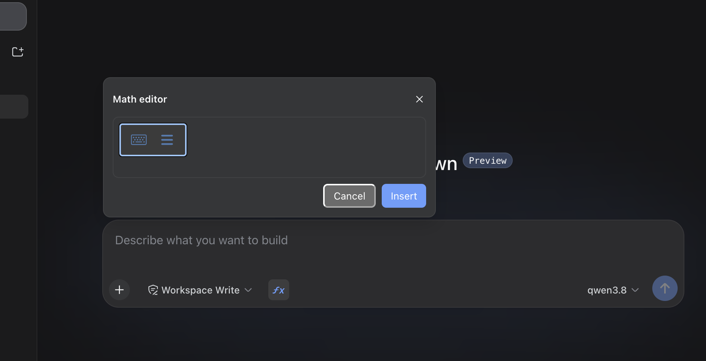

# dsh-client-math-input

[](https://www.npmjs.com/package/@louisdevzz/dsh-client-math-input)
[](https://github.com/louisdevzz/dsh-client-math-input)

A visual equation editor for the DeepSeek Harness web composer. Adds an
**ƒx** button next to the message box; it opens a
[MathLive](https://mathlive.io) math field, and Insert writes the field's
LaTeX into your draft as a `$$...$$` block — so the model reads canonical
LaTeX instead of you hand-typing `\frac{...}{...}` syntax.



## Install

```sh
dsh plugin --profile web add @louisdevzz/dsh-client-math-input
```

Restart `dsh web`. The ƒx button appears in the composer's tool row, next to
the attach/plan controls.

Without the `dsh plugin` bundle machinery: `pnpm link` this package into
`$DSH_HOME/profiles/<name>` and add an `insert` row for
`@louisdevzz/dsh-client-math-input` to that profile's own `cordis.patch.yml`
(the row shape is in this repo's `cordis.patch.yml`).

## What you get

- **ƒx button** in the composer tool row — registered into ui-conversation's
  `conversation.input.left` seat, beside the existing chrome (access mode,
  plan, attach), not replacing it
- **MathLive editor popup** — the full interactive `<math-field>` widget
  (built-in LaTeX commands, virtual keyboard, keyboard shortcuts), floating
  above the composer the same way the slash-command menu does
- **Word paste** (best-effort) — pasting a Word equation recovers its LaTeX
  when Word's clipboard includes a MathML fallback (see below); everything
  else pastes into the field exactly as MathLive already handles it
- **Zero session-log/model changes** — Insert just writes plain `$$...$$`
  text into the draft; the model sees ordinary message text, nothing new to
  learn on the wire

## Pasting from Word

MathLive's own paste handler only reads `application/json+mathlive`,
`application/json` (with a compute engine loaded — not enabled here),
`application/x-latex`, and `text/plain` off the clipboard. A Word equation is
none of those — Word's clipboard carries it as OMML/an image, with an HTML
fallback for other apps — so pasting a Word equation directly into MathLive
normally does nothing.

Word (since roughly 2018) additionally embeds a real `<math>` MathML island in
that HTML fallback. This plugin intercepts `paste` in the capture phase,
checks the clipboard's `text/html` payload for a `<math>` element, and if
found converts it to LaTeX with [mathml-to-latex](https://github.com/asnunes/mathml-to-latex)
before MathLive's own handler ever sees the event. If no MathML is present
(older Word, or an equation copied as a plain image), the event is left alone
and MathLive's normal paste behavior runs exactly as before.

Not verified against a live Word paste (no Word/browser in the environment
this was built in) — only against a hand-built HTML fragment shaped like
Word's documented MathML fallback (`src/client/word-paste.test.ts`, `pnpm
test`). If it doesn't work with your Word version: open devtools, run
`document.addEventListener('paste', e => console.log(e.clipboardData.getData('text/html')), true)`,
paste the equation, and check whether the logged HTML contains a `<math>` tag
— if not, there's nothing this plugin can recover from that paste (would need
a full OMML parser, not attempted here).

## Known limitations

- No outside-click dismissal on the popup (closes via ✕, Cancel, Insert, or
  Escape) — not needed to prove the LaTeX round-trip, so deliberately
  deferred
- Always inserts display-mode (`$$...$$`); no inline-math toggle
- Word-paste recovery only handles the case where Word's clipboard includes a
  MathML fallback; OMML-only paste (older Word, or Word configured without
  the MathML fallback) still silently does nothing
- `lib/client.js` is ~1.5MB (mathlive + mathml-to-latex, both bundled since
  neither is a shared platform module) — fine for a manually-installed
  personal plugin, not optimized for load time
- Types for `@deepseek-ai/dsh-client-*` are pinned to `^0.1.1-rc.2` (the
  `next` dist-tag) — the npm `latest` tag for these packages currently points
  at a much older, incompletely-published `0.0.1-rc.1` line; do not loosen
  these version pins to an unpinned range

## Build from source

```sh
pnpm install
pnpm build       # tsc declarations (lib/types) + tsdown browser/node bundles (lib/)
pnpm typecheck
pnpm test        # word-paste MathML recovery, node:test + jsdom
```

`src/index.ts` is the host-side plugin half (a no-op; this is a pure browser
UI plugin). `src/client/index.ts` is the browser half: it registers the ƒx
button into `conversation.input.left` and the editor popup into
`conversation.input.overlay`, sharing one open/closed store between them.

`tsdown.config.ts` builds on `tsdown.client.ts` (adapted from DSH's internal
`packages/client/tsdown.client.ts` preset): the browser bundle is a
closure-factory artifact (`window.__ModuleLoader__.load({id, factory})`) that
resolves `react`, `@deepseek-ai/cordis`, `@deepseek-ai/dsh-client-ui-slots`,
`@deepseek-ai/dsh-client-ui-primitives`, and
`@deepseek-ai/dsh-client-runtime/client` through the running dsh app's own
module table instead of bundling them — those must stay the same singleton
instances as the rest of the app. `mathlive` and `mathml-to-latex` are
genuine dependencies and get bundled directly into `lib/client.js`.

One non-obvious fix baked into `tsdown.config.ts`: mathlive's package.json
exports a conditional entry keyed on `browser`/`node`/`default`, and rolldown
(running under Node) resolves it via the `node` condition — landing on
`mathlive-ssr.min.mjs`, a headless rendering build with no `<math-field>`
custom element at all. The config resolves `mathlive.min.mjs` explicitly
instead of trusting the exports map.

This is an out-of-tree plugin, independent of the deepseek-harness monorepo
— see [docs/user/develop/basic/publish.md](https://github.com/deepseek-ai/deepseek-harness/blob/master/docs/user/develop/basic/publish.md)
in that repo for the profile/bundle plugin model this package follows.

## License

MIT
